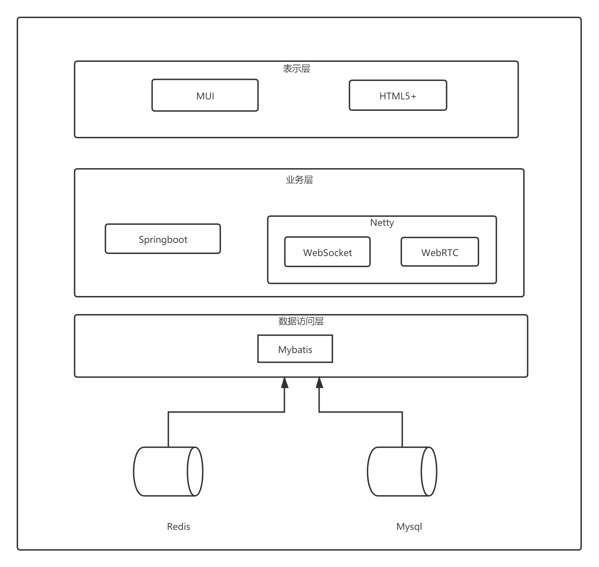
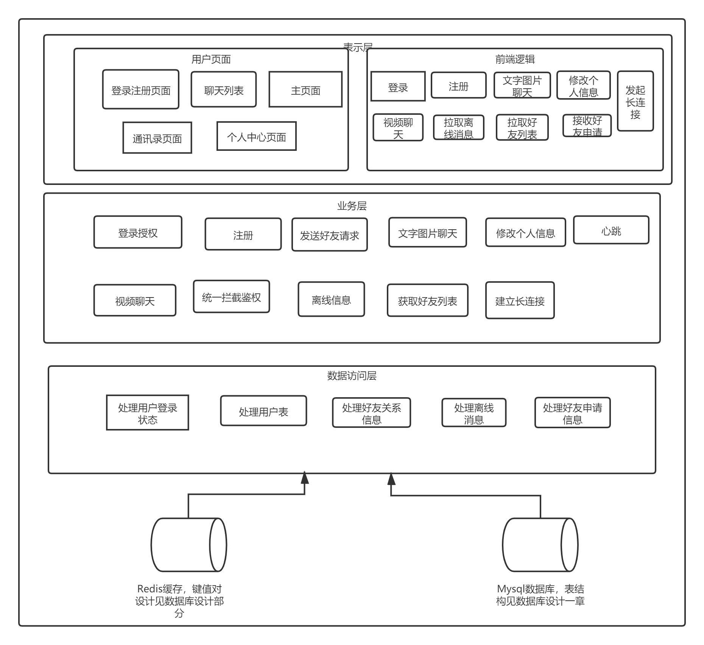
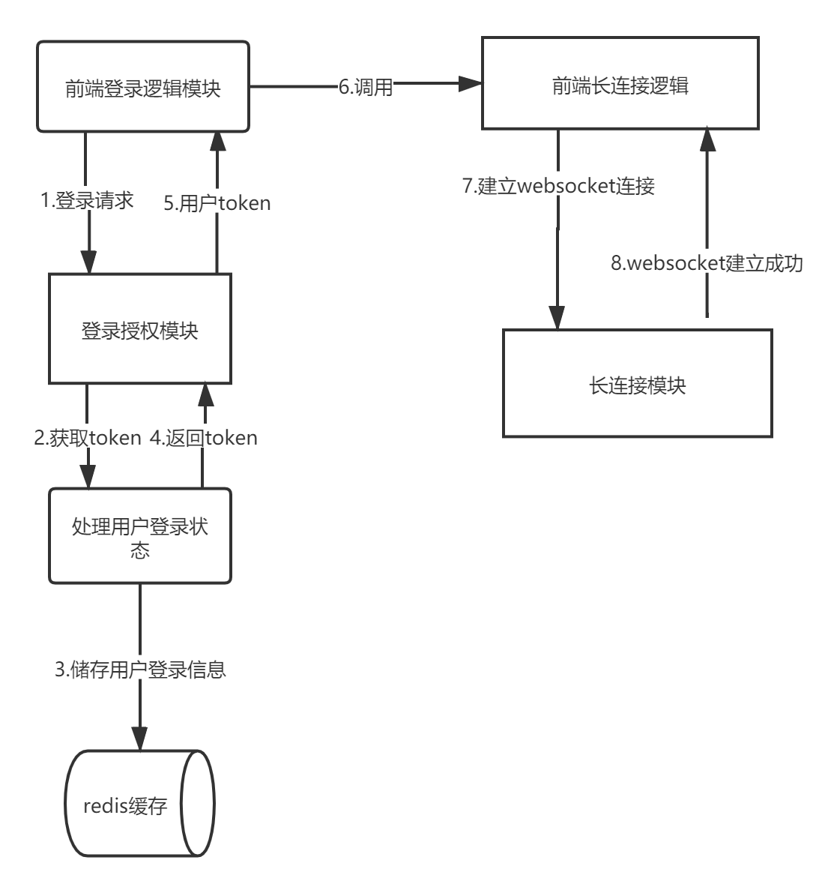
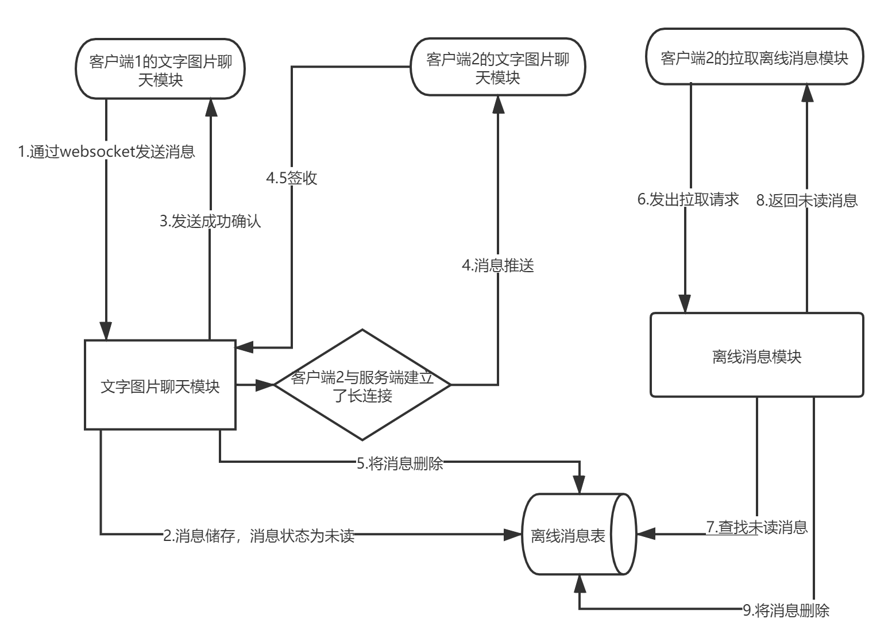
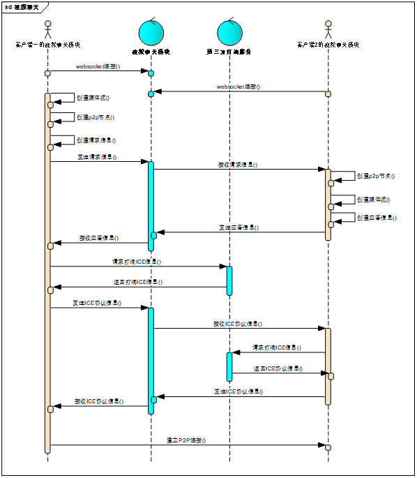
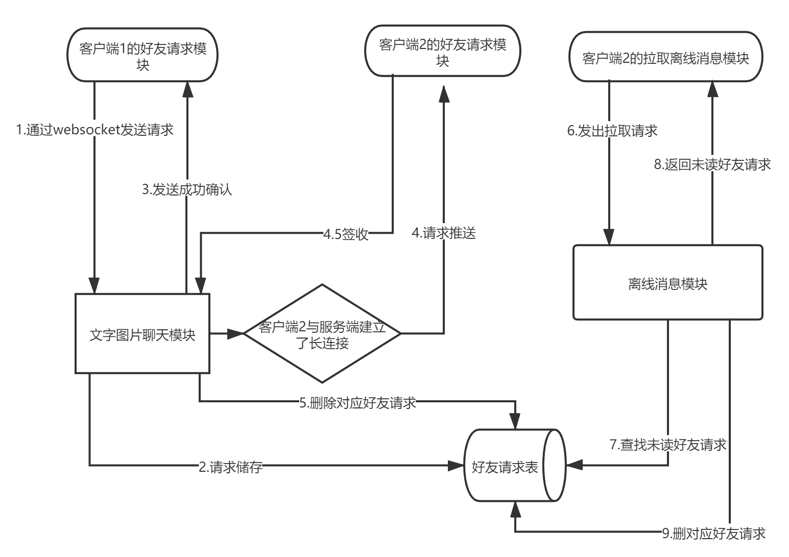
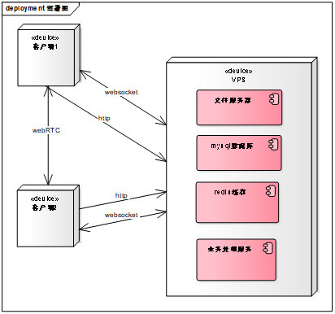

# "易聊"系统架构设计说明书

目录

"易聊"系统架构设计说明书 1

[一、 简单的需求文档 2](\l)

[1. 功能需求 2](\l)

[2. 非功能需求 3](\l)

[二、 系统架构设计 4](\l)

[1. 技术架构 4](\l)

[2. 逻辑架构 5](\l)

[1.1 整体逻辑架构及说明 5](\l)

[1.2用例的协作图 5](\l)

[3. 部署架构 9](\l)

## 简单的需求文档

#### 功能需求


用例图说明：

> 一，用户需要能够通过自行确定用户名注册IM软件，注册后不可更改，可以根据 其他用户的用户名添加对方为好友。
>
> 二，用户可以同自己的好友进行文字聊天和视频聊天，文字聊天包括文字，图片的 使用。


用例分析

+--------------------------------------------+
| 用例名：添加好友                           |
+--------------------------------------------+
| 简要描述：用户可以通过账户，搜索并添加好友 |
+--------------------------------------------+
| 参与者：用户                               |
+--------------------------------------------+
| 相关用例：登录                             |
+--------------------------------------------+
| 前置条件：用户已登录                       |
+--------------------------------------------+
| 后置条件：用户添加好友成功                 |
|                                            |
| 基本路径：                                 |
|                                            |
| 1.打开添加好友页面                         |
|                                            |
| 2.输入要查找的账号                         |
|                                            |
| 3.根据查找结果点选添加好友                 |
+--------------------------------------------+
| 补充约束：无                               |
+--------------------------------------------+

+------------------------------------------------------------------------------------+
| 用例名：与好友文字聊天                                                             |
+------------------------------------------------------------------------------------+
| 简要描述：用户可以与好友进行一对一文字聊天，并能够同时和多个好友进行一对一文字聊天 |
+------------------------------------------------------------------------------------+
| 参与者：用户                                                                       |
+------------------------------------------------------------------------------------+
| 相关用例：登录                                                                     |
+------------------------------------------------------------------------------------+
| 前置条件：用户已登陆                                                               |
+------------------------------------------------------------------------------------+
| 后置条件：用户正常文字聊天                                                         |
|                                                                                    |
| 基本路径：                                                                         |
|                                                                                    |
| 1.  用户点击好友头像或聊天记录框，进入聊天页面                                     |
|                                                                                    |
| 2.  通过文字或图片与好友聊天                                                       |
|                                                                                    |
| 3.  如有其他好友同时聊天，可以再聊天窗口间进行切换                                 |
+------------------------------------------------------------------------------------+
| 补充约束：无                                                                       |
+------------------------------------------------------------------------------------+

+----------------------------------------------------------------------------+
| 用例名：与好友视频聊天                                                     |
+----------------------------------------------------------------------------+
| 简要描述：用户可以与好友进行一对一聊天，并能够同时和多个好友进行一对一聊天 |
+----------------------------------------------------------------------------+
| 参与者：用户                                                               |
+----------------------------------------------------------------------------+
| 相关用例：登录                                                             |
+----------------------------------------------------------------------------+
| 前置条件：用户已登陆                                                       |
+----------------------------------------------------------------------------+
| 后置条件：用户正常视频聊天                                                 |
|                                                                            |
| 基本路径：                                                                 |
|                                                                            |
| 1.  用户点击好友头像或聊天记录框，进入聊天页面                             |
|                                                                            |
| 2.  点击聊天框右侧加号，弹出选择框                                         |
|                                                                            |
| 3.  选择视频聊天                                                           |
|                                                                            |
| ```{=html}                                                                 |
| <!-- -->                                                                   |
| ```                                                                        |
| 4.  好友接收到视频请求，同意或拒绝                                         |
|                                                                            |
| 5.  同意则开始视频聊天，拒绝则通知聊天发起者，对方拒绝了请求               |
+----------------------------------------------------------------------------+
| 补充约束：无                                                               |
+----------------------------------------------------------------------------+

#### 非功能需求

-------------- -------- ----------------------------------------------------
  需求名称       使用者   简要描述
  信息安全需求   用户     用户需要保障聊天信息的隐私性，避免消息泄露
  信息及时需求   用户     作为IM软件，必须保证信息以最快的速度到达用户客户端
  信息完整需求   用户     用户需要保证自己的信息被完整送达，不存再消息丢失
  交互需求       用户     用户需要前端页面有良好的交互性
-------------- -------- ----------------------------------------------------

## 系统架构设计

1.  ### 技术架构

    {width="5.764583333333333in" height="5.456944444444445in"}

    **客户端**：客户端采用MUI+HTML5+，使用web技术构建安卓及IOS的客户端。

    **业务层**：使用Springboot框架开发后端各种逻辑，做统一管理，用Springboot整合netty， redis，mysql和mybatis。Netty用于构建Websocket链接和WebRTC链接，WebSocket 实现好友请求，文字聊天等业务，WebRTC实现视频聊天。

    **数据访问层**：mybatis作为持久层框架，来处理业务层与mysql数据库的交互，与redis缓存 的交互使用redis的接口实现。

    **数据库**：Redis缓存用来保存客户登录的token等数据，MySQL用于保存用户信息，离线消 息等持久化数据。

### 2. 逻辑架构 {#逻辑架构 .list-paragraph}

#### 1.1 整体逻辑架构及说明

{width="5.754166666666666in" height="5.2652777777777775in"}

**表示层**：包含登录注册页面，聊天列表页面，通讯录页面，个人中心页面，以及对应的 登录，聊天等逻辑

**业务层**：IM系统各项功能的逻辑实现，包括登陆授权，统一鉴权，好友请求，聊天， **其中视频聊天需要通过业务层帮助两个客户端建立WebRTC的P2P链接，仍 然需要业务层支持**

**数据访问层**：对Mysql中，用户表，消息表，好友申请表的增删改查功能，对redis中 登录状态信息进行增删改查的功能

#### 1.2 用例的协作图

**注：本章中，部分图例中隐去了数据交互层的模块，因为比较简单，一听名字就知道什么时候用，怎么用，就不画了。**

#### 1.2.1 登录用例协作图 

{width="5.5993055555555555in" height="6.05625in"}

首先前端登录模块向后端登录授权模块发起请求，登录授权模块调用处理用户登录状态模块生成随机token，并将用户id作为key，token等其他信息作为value存入redis缓存，然后返回token，最后登录模块向前端登录逻辑模块返回token，前端将token存入cookie，每次发起请求时将cookie加入报文头部，同时，登陆后与服务器建立长连接。

#### 1.2.2 文字聊天协作图

{width="5.759027777777778in" height="4.120138888888889in"}

首先客户端1的文字聊天模块通过websocket发送消息，文字图片聊天模块接收到消息后，将消息储存到离线消息表，然后检查目标的websocket连接，如果没有连接，则结束，如果有链接，则推送消息，并将消息删除。 在客户端2重新启动后，会调用拉取离线消息模块，拉取离线消息，拉取成功后将消息删除。[这里虽然将文字图片聊天归为了同一个用例，但是发送文字和发送图片会有少许不同，主要体现在，发送图片需要将图片存在文件服务器内，数据里只存图片链接。]{.underline}**这里选择了删除消息而不是将消息状态置为已读，是因为如果系统客户量大，有大量的离线消息，会导致离线消息表过大，成为性能瓶颈，如果未来要提供消息漫游功能，也可以选择将消息状态置为已读，但后期会涉及到分表分库工作。**

#### 1.2.3 视频聊天协作图

由于这部分涉及到的模块比较少，但是流程比较复杂，用协作图画出来太乱了，用一张时序图代替，时序图与协作图都是交互图的一种，都能描述对象间如何交互。

{width="5.264583333333333in" height="6.050694444444445in"}

流程比较复杂，首先，客户端一二要保证与服务器建立了ws连接，这个其实并非这两个视频聊天模块要做的，但是为了显示方便，画上去了，然后由客户端一建立媒体流和本地的p2p节点，然后把描述信息发送给客户端2，客户端2接收到后，进行与客户端1相同的操作，然后客户端一向打洞服务器，请求自己的IP地址，这里使用的是ICE协议，打洞服务器把相应的信息返回，客户端一再把这个信息发送给客户端2，客户端2也如此操作，然后双方就建立了p2p连接，可以进行视频通话。

#### 1.2.4 好友申请协作图

{width="5.761805555555555in" height="4.06875in"}

类似文字聊天用例的协作图，只需要替换对应的模块即可

### 3. 部署架构

{width="5.521527777777778in" height="5.18125in"}

因为服务器数量限制，所以所有的服务都会部署在小组已有的一台2核4G的腾讯云VPS上。两个客户端间的webRTC是用于视频聊天，只有在发起视频聊天时，才会由服务器辅助构建。
