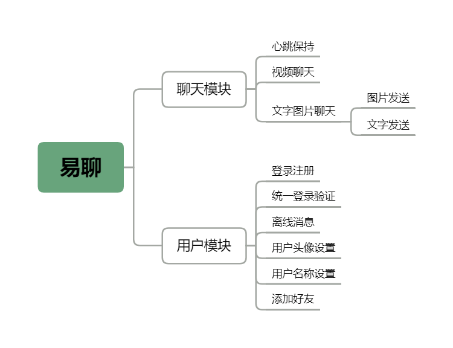
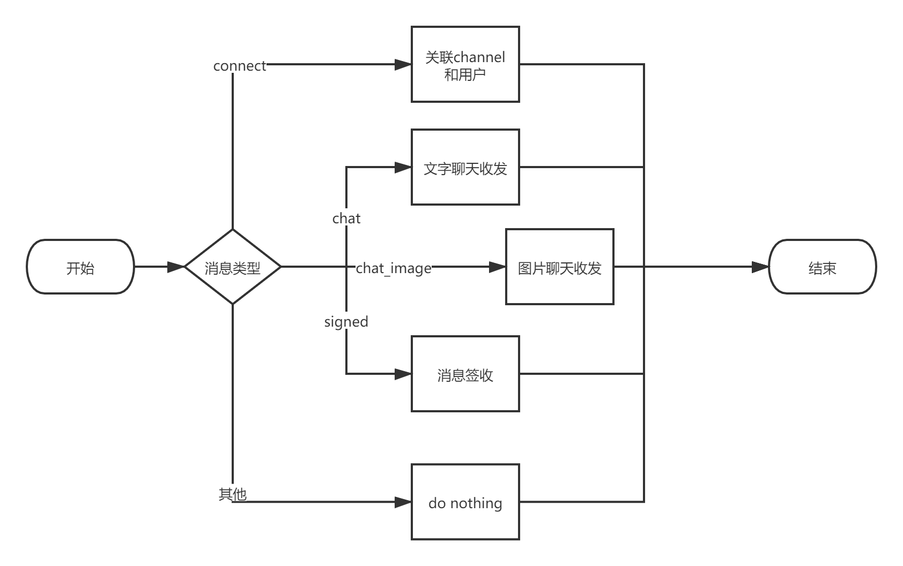
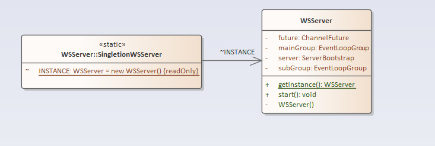
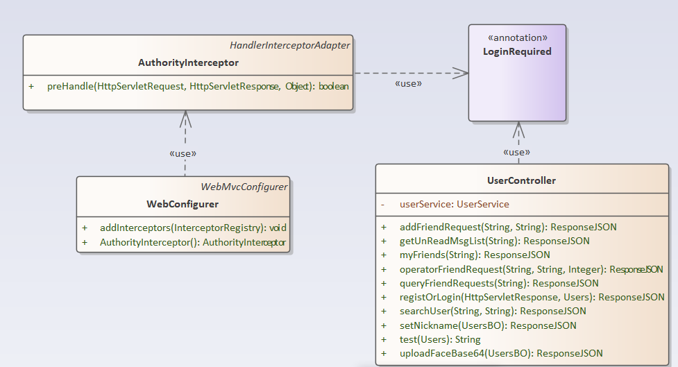
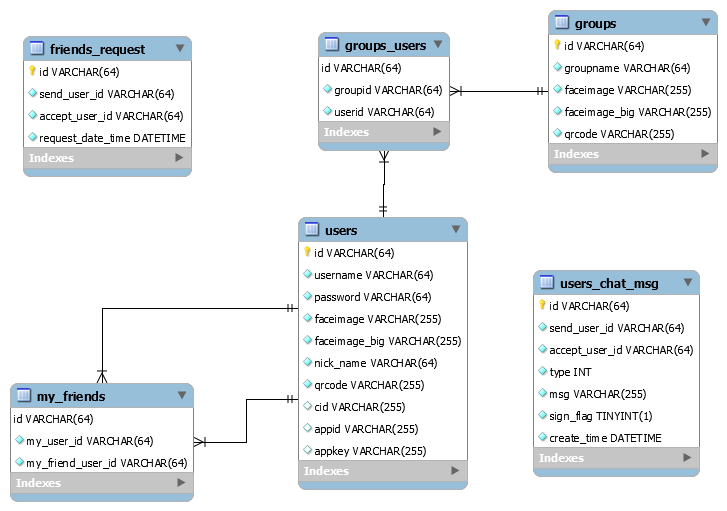

# “易聊”软件设计说明书
[TOC]
## 1    引言

### 1.1    背景
课程作业要求完成一个聊天软件，平台不限，至少要求最基础的聊天功能。本项目内部开发代号为“易聊”。

### 1.2    参考资料
暂无

### 1.3   术语定义及说明
暂无

## 2  设计概述
### 2.1   任务和目标
预计完成好友功能，文字图片聊天，视频聊天功能。

### 2.1.1      需求概述
业务需求见架构设计说明书，本系统的性能需求要求能够承担每秒1万次请求（注：由于没有实际项目经验，参考了csdn对netty的一篇测试），可以看到阿里云8核16G的服务器能承担三万左右并发，由于本系统的部署机为2核4G，预估性能瓶颈为每秒1万次请求。

### 2.1.2      运行环境概述
本系统运行在2核4G的腾讯云服务器上，硬盘大小为50G。操作系统采用ubuntu18.04，数据库使用mysql，使用redis缓存，使用fastDFS文件服务器管理文件。

### 2.1.3      条件与限制
详细描述系统所受的内部和外部条件的约束和限制说明。包括业务和技术方面的条件与限制以及进度、管理等方面的限制。

### 2.1.4      详细设计方法和工具
简要说明详细设计所采用的方法和使用的工具。如HIPO图方法、IDEF（I2DEF）方法、E－R图，数据流程图、业务流程图、选用的CASE工具等，尽量采用标准规范和辅助工具。

## 3   模块设计


如图，系统划分为聊天模块和用户管理模块，聊天模块与用用户管理模块功能重叠比较小，使用的技术也不同，开发时也很方便并行开发。

聊天模块中，文字图片聊天，视频发送的ws链接部分，心跳保持模块，分别是netty的管道模式（责任链模式）上的3个valve（责任链的处理单元），可以分开编写，并行开发。视频聊天模块中使用websocket的部分也可以作为一个valve来实现，webRTC部分则需要另外实现。

用户模块中，离线消息作为用户模块的一部分似乎并不合理，但是由于离线消息是采用拉取的方式，而不是推送的方式，所以在编码是是可以放在用户的controller里的。统一登录验证采用基于注解的拦截器模式，通过在springboot框架下自定义注解，然后在需要登录的接口前添加@LoginRequired注解即可。其他均为用户路由的接口。


## 4 接口定义

代码框架已经搭建好，请开发人员结合代码框架和本部分，编写程序

### 4.1 通用枚举类说明

只保留枚举量的定义，未写出方法，方法请参照具体的代码

```java
/**
 *  @Description:忽略或通过好友请求的枚举
 */
public enum FriendRequestOperatorEnum {
    IGNORE(0, "忽略"),
	PASS(1, "通过");
}


/**
 * 
 * @Description: 发送消息的动作 枚举
 */

public enum MsgActionEnum {
    
	CONNECT(1, "第一次(或重连)初始化连接"),
	CHAT(2, "聊天消息"),	
	SIGNED(3, "消息签收"),
	KEEPALIVE(4, "客户端保持心跳"),
    PULL_FRIEND(5, "拉取好友"),
	Friend_Request(6,"发送好友请求"),
	CHAT_IMAGE(7,"消息是图片");
}

package cn.mikyan.enums;

/**
 * @Description: 消息签收状态的枚举
 */
public enum MsgSignFlagEnum {
    
	UNSIGN(0, "未签收"),
	SIGNED(1, "已签收");	
	
}

package cn.mikyan.enums;


/**
 * @Description:添加好友的状态
 */
public enum SearchFriendsStatusEnum {
    SUCCESS(0, "OK"),
	NOT_EXIST(1, "无此用户"),	
	NOT_YOURSELF(2, "不能添加自己"),			
	ALREADY_FRIENDS(3, "不能重复添加好友");
}
```


### 4.1 接口会使用的类说明

#### 4.1.1 接口使用的实体类说明

实体类只有属性和get，set方法，所以下面只列出属性，省去get，set方法

```java
HttpServletResponse response; //http的响应体，仅在登录注册中会用到

public class UsersBO {
    private String userId;
    private String faceData;
    private String nickname;
}// 前端回传用户昵称等信息时使用的实体类

public class UsersVO {
    private String id;
    private String username;
    private String faceImage;
    private String faceImageBig;
    private String nickname;
	private String qrcode;
} //后端发送用户信息时用的实体类

package cn.mikyan.netty.pojo;
public class ChatMsg implements Serializable {
    
	private static final long serialVersionUID = 1L;
	
	private String senderId;		// 发送者的用户id	
	private String receiverId;		// 接受者的用户id
	private String msg;				// 聊天内容
    private String msgId;			// 用于消息的签收
    private Integer type;           // 用于判断消息类型
	
}//用于前后端传输消息的实体类

package cn.mikyan.pojo;
public class UsersChatMsg {

    private String id;
    private String sendUserId;
    private String acceptUserId;
    private Integer type;
    private String msg;
    private Boolean signFlag;
    private Date createTime;
}//用于后端储存消息到数据库的实体类

package cn.mikyan.pojo;

import javax.persistence.*;

public class Users {
    private String id;
    private String username;
    private String password;
    private String faceimage;
    private String faceimageBig;
    private String nickName;
    private String qrcode;
    private String cid;
    private String appid;
    private String appkey;
}//主要用于登录注册时前端返回用户信息，并用于用户信息的储存


public class FriendRequestVO {
    
    private String sendUserId;
    private String sendUsername;
    private String sendFaceImage;
    private String sendNickname;
}//后端发送到前端的好友请求信息
```

#### 4.1.2 接口使用的统一响应类

未标出getter和setter方法

```java

/**
 * @Description: 自定义响应数据结构
 *				本类的作用是后端接口响应的统一结构题，如果需要返回信息，则存在该实体类的data字段里
 * 				前端接受此类数据后需要使用本类的方法转换成对于的数据类型格式（类，或者list）
 * 				200：表示成功
 * 				500：表示错误，错误信息在msg字段中
 * 				501：bean验证错误，不管多少个错误都以map形式返回
 * 				502：拦截器拦截到用户token出错
 * 				555：异常抛出信息
 */

public class ResponseJSON {
       // 响应业务状态
    private Integer status;

    // 响应消息
    private String msg;

    // 响应中的数据
    private Object data;
    
    public static ResponseJSON build(Integer status, String msg, Object data) {
        return new ResponseJSON(status, msg, data);
    }

    //返回正确，并携带数据体，如返回好友信息等
    public static ResponseJSON ok(Object data) {
        return new ResponseJSON(data);
    }

    //返回正确，不携带数据体，如返回拒绝好友请求
    public static ResponseJSON ok() {
        return new ResponseJSON(null);
    }
    
    //返回错误和错误信息
    public static ResponseJSON errorMsg(String msg) {
        return new ResponseJSON(500, msg, null);
    }
    
    //返回bean验证错误
    public static ResponseJSON errorMap(Object data) {
        return new ResponseJSON(501, "error", data);
    }
    
    //返回token错误
    public static ResponseJSON errorTokenMsg(String msg) {
        return new ResponseJSON(502, msg, null);
    }

    //返回异常
    public static ResponseJSON errorException(String msg) {
        return new ResponseJSON(555, msg, null);
    }

    public ResponseJSON() {

    }

    public ResponseJSON(Integer status, String msg, Object data) {
        this.status = status;
        this.msg = msg;
        this.data = data;
    }

    public ResponseJSON(Object data) {
        this.status = 200;
        this.msg = "OK";
        this.data = data;
    }

    public Boolean isOK() {
        return this.status == 200;
    }
}
```


### 4.2接口说明


api遵守RESTful规则，第一版api统一使用v1/作为地址第一层，用户路由使用u做为地址第二层

所以用户接口的api命名规范为 v1/u/“api名称”。下面说明各api的功能，输入，输出。

由于api由统一前缀，所以下面的表格只写api名称

由于api统一返回ResponseJSON，所以输出部分只写返回的data字段,以下均使用POST协议

@LoginRequired  表示需要登录

| 名称                  | 输入                                                    | 输出                            | 功能                     | 前置条件       |
| --------------------- | ------------------------------------------------------- | ------------------------------- | ------------------------ | -------------- |
| registerOrLogin       | HttpServletResponse， Users                             | UserVO（把token携带在cookie里） | 进行登录或注册           |                |
| uploadFaceBase64      | UsersBO                                                 | UserVO                          | 通过base64方法，上传头像 | @LoginRequired |
| setNickname           | UsersBO                                                 | UserVO                          | 设置昵称                 | @LoginRequired |
| search                | String myUserId, String friendUsername                  | UserVO                          | 搜索其他用户             | @LoginRequired |
| addFriendRequest      | String myUserId, String friendUsername                  | ResponseJSON.ok()               | 发送添加好友的请求       | @LoginRequired |
| queryFriendRequests   | String userId                                           | List<FriendRequestVO>           | 查询好友请求             | @LoginRequired |
| operatorFriendRequest | String acceptUserId, String sendUserId,Integer operType | ResponseJSON.ok()               | 接受或忽略好友请求       | @LoginRequired |
| myFriends             | String usersid                                          | List<Users>                     | 查询好友列表             | @LoginRequired |
| getUnReadMsgList      | String acceptUserId                                     | List<ChatMsg>                   | 拉取离线消息             | @LoginRequired |

### 4.3 netty的handler说明

1.ChatHandler

本类，负责聊天的处理，图片和文字均在此handler里处理，同时负责处理建立userid和channel的对应



2. HeartBeatHandler

这个handler逻辑很简单，主要是处理websocket链接的保持和关闭


## 5 代码设计

#### 1.

为保证只有一个WebSocket服务实例对WSServer类采用单例模式



#### 2.

基于spring注解驱动的过滤器

这和传统的拦截过滤器在编写的时候有所不同，由于spring已经帮我们定义好了拦截器的接口，和父类，我们只需要集成HandlerInterceptorAdapter这个类，并重写他的preHandle方法，就可以实现我们的拦截器，同时通过自定义注解，我们在使用时，只需要在接口前添加@LoginRequired注解即可()，注意，以下类图只是我们编码时会使用的类，但基于spring的注解拦截方式会涉及到更多的类。



#### 3.netty的管道模式

由于使用netty来搭建WebSocket服务器，所以对netty的管道模式做一定的了解

## 6  用户界面设计


### 5.3          系统界面详细设计
系统界面说明应用系统软件的各种接口。整个系统的其他接口（如系统硬件接口、通讯接口等）在相应的部分说明。

#### 5.3.1      外部界面设计
根据系统界面划分进行系统外部界面设计，对系统的所有外部接口（包括功能和数据接口）进行设计。

#### 5.3.2      内部界面设计
设计系统内部各功能模块间的调用关系和数据接口。

#### 5.3.3      用户界面设计
规定人机界面的内容、界面风格、调用方式等，包括所谓的表单设计、报表设计和用户需要的打印输出等设计。此部分内容可能比较多。

## 6、数据库系统设计
此数据库设计可单独成册，尤其对大型的数据库应用系统，即有一个单独的《数据库设计说明书》。

### 6.1设计要求
### 6.2 信息模型设计
确定系统信息的类型（实体或视图），确定系统信息实体的属性、关键字及实体之间的联系，详细描述数据库和结构设计，数据元素及属性定义，数据关系模式，数据约束和限制。

### 6.3    数据库设计
#### 6.3.1   设计依据
由于用户的登录信息需要被频繁访问到，所以使用redis存在内存里，用户的消息需要做离线消息，

说明数据被访问的频度和流量，最大数据存储量，数据增长量，存储时间等数据库设计依据。

#### 6.3.2   数据库种类及特点
说明系统内应用的数据库种类、各自的特点、数量及如何实现互联，数据如何传递。

#### 6.3.3   数据库逻辑结构



如图，my_friends表记录

#### 6.3.4   物理结构设计
列出所使用的数据结构中每个数据项的存储要求、访问方法、存取单位和存取物理关系等。建立系统程序员视图，包括：

Ÿ  数据在内存中的安排，包括对索引区、缓冲区的设计；

Ÿ  所使用的外存设备及外存空间的组织，包括索引区、数据块的组织与划分；

Ÿ  访问数据的方式方法。

#### 6.3.5   数据库安全
说明数据的共享方式，如何保证数据的安全性及保密性。

#### 6.3.6   数据字典
编写详细的数据字典。 对数据库设计中涉及到的各种项目，如数据项、记录、系、文卷模式、子模式等一般要建立起数据字典，以说明它们的标识符、同义名及有关信息。
