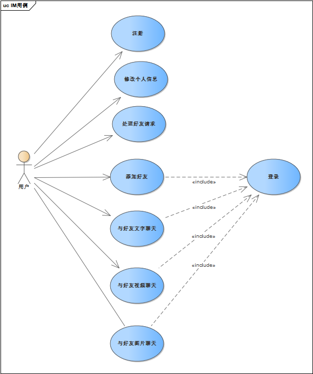

# “易聊”软件设计说明书
[TOC]
## 1    引言

### 1.1    背景
课程作业要求完成一个聊天软件，平台不限，至少要求最基础的聊天功能。本项目内部开发代号为“易聊”。

### 1.2    参考资料

netty源码

https://github.com/netty/netty

openjdk11源码

https://github.com/AdoptOpenJDK/openjdk-jdk11u

tiny-spring源码

https://github.com/code4craft/tiny-spring


## 2  设计概述
### 2.1   任务和目标
​		预计完成好友功能，文字图片聊天，视频聊天功能。

### 2.1.1      需求概述
​		业务需求见架构设计说明书，本系统的性能需求要求能够承担每秒1万次请求（注：由于没有实际项目经验，参考了csdn对netty的一篇测试），可以看到阿里云8核16G的服务器能承担三万左右并发，由于本系统的部署机为2核4G，预估性能瓶颈为每秒1万次请求。

### 2.1.2      运行环境概述
​		本系统运行在2核4G的腾讯云服务器上，硬盘大小为50G。操作系统采用ubuntu18.04，数据库使用mysql，使用redis缓存，使用fastDFS文件服务器管理文件。

### 2.1.3      详细设计方法和工具
​		本设计文档包括，模块图，UML活动图，接口定义，包图，代码设计讲解，用户UI设计，数据库设计。

## 3   模块设计


		如图，系统划分为聊天模块和用户管理模块，聊天模块与用用户管理模块功能重叠比较小，使用的技术也不同，开发时也很方便并行开发。

​		聊天模块中，文字图片聊天，视频发送的ws链接部分，心跳保持模块，分别是netty的管道模式（责任链模式）上的3个valve（责任链的处理单元），可以分开编写，并行开发。视频聊天模块中使用websocket的部分也可以作为一个valve来实现，webRTC部分则需要另外实现。

​		用户模块中，离线消息作为用户模块的一部分似乎并不合理，但是由于离线消息是采用拉取的方式，而不是推送的方式，所以在编码是是可以放在用户的controller里的。统一登录验证采用基于注解的拦截器模式，通过在springboot框架下自定义注解，然后在需要登录的接口前添加@LoginRequired注解即可。其他均为用户路由的接口。 

## 4   项目结构


​		注意，本图中没有画出部分不涉及到引用关系的子图


​		项目的根目录为cn.mikyan，同时我们在外部引入了包org:n3r这个包，用于生成字符串型的id。下面主要介绍cn.mikyan包下的子包功能

​		cn.mikyan包下的类包括启动类和配置类，用于项目的启动和配置。utils包是全局工具类，需要的通用工具都包含在这个包里。service包定义了后端的主要服务，所有的后端服务都在这个包里实现。controller包利用service包内提供的服务，编写接口，负责与前端的交互。enums包下编写全局枚举量，主要用于controller类。pojo下编写全局实体类，主要保存交互对象，例如消息对象，用户对象等。mapper是ORM(对象关系模型)中的对象所在包。netty包负责所有websocket相关的处理，主要聊天功能都在这里实现。


## 5   流程逻辑

### 5.1 整体用例



​		请注意我们本次的消息设计说明书细化了用例，将图片聊天这一用例从文字聊天内独立了出来，方便说明，同时增加了修改个人信息的用例。

### 5.2各用例活动图

​		以下活动图，设计到前后端传输的情况，传输所用的消息格式，见接口定义.接口说明一节的接口输入，和nettyhandler说明一节的交互格式。

#### 5.2.1注册登录


​		在前端，登录注册并做一个按钮，后端也是写在一起，所以这里只画一个活动图，首先，用户打开软件，然后软件判断用户是否已登录，如果已经登录则保持打开的chatlist，否则跳转到登陆注册页面，然后用户输入账户密码，点击登录注册按钮，数据被传回后端，后端直接判断是否已注册，未注册则直接注册，已注册则登录。

#### 5.2.2 添加好友（拉式，第一次迭代）


如图，添加好友时，先到好友列表页搜索好友，搜到后点击添加，然后后端先把申请信息入库。

#### 5.2.3 接受好友请求（拉式，第一次迭代）


用户每次进入聊天列表页，都会调用拉取好友申请的接口，然后后端返回好友申请信息，用户在弹出的好友申请条上点击同意或不同意，同意则添加好友关系，不同意则直接删除好友请求。

#### 5.2.4 添加好友（推式，第二次迭代）


如图，添加好友时，先到好友列表页搜索好友，搜到后点击添加，然后后端先把申请信息入库（避免用户不在线），然后通过WsServer向目标好友发送请求,如果好友在线收到了请求，则返回接收确认，后端删除请求信息，否则结束。

#### 5.2.5  接受好友请求（推式，第二次迭代）


如图，用户收到请求后，点击同意或拒绝，若拒绝，给申请者返回拒绝信息，若同意，添加好友关系，给接受者返回申请者的用户信息，向申请者发送同意信息，然后申请者更新好友信息列表。

#### 5.2.6 与好友文字聊天


如图，用户首先会打开聊天页面，然后在输入框内输入文字，然后点击发送，想Wsserver发送信息，Wsserver根据接收者id找到对应channel，然后会向接收者推送消息，如果接收者返回了签收信息，则标记消息为已读，否则直接流程结束。

#### 5.2.7 与好友图片聊天


与文字聊天类似，只是多了前端选择发送图片和转换图片为base64的部分。

#### 5.2.8 与好友视频聊天（第二次迭代）

本流程图与架构设计中的协作图一章中相同，就用时序图吧，都能说明白。


首先，客户端一二要保证与服务器建立了ws连接，然后由客户端一（发起视频聊天的一方）建立媒体流和本地的p2p节点，然后把描述信息发送给后端，后端再发送给客户端2，客户端2接收到后，进行与客户端1相同的操作，然后客户端一向打洞服务器，请求自己的IP地址，这里使用的是ICE协议，打洞服务器把相应的信息返回，客户端一再把这个信息发送给客户端2，客户端2也如此操作，然后双方就建立了p2p连接，可以进行视频通话。


#### 5.2.9 修改个人信息


以修改头像为例，其他类似，用户首先选择个人信息页，然后点击头像进行修改，打开系统相册选择图片，然后截取图片，然后确定，更新本地头像之后转换为base64编码调用修改用户头像接口，对数据库的用户头像进行更改。


## 6 接口定义

代码框架已经搭建好，请开发人员结合代码框架和本部分，编写程序

### 6.1 通用枚举类说明

只保留枚举量的定义，未写出方法，方法请参照具体的代码

```java
/**
 *  @Description:忽略或通过好友请求的枚举
 */
public enum FriendRequestOperatorEnum {
    IGNORE(0, "忽略"),
	PASS(1, "通过");
}


/**
 * 
 * @Description: 发送消息的动作 枚举
 */

public enum MsgActionEnum {
    
	CONNECT(1, "第一次(或重连)初始化连接"),
	CHAT(2, "聊天消息"),	
	SIGNED(3, "消息签收"),
	KEEPALIVE(4, "客户端保持心跳"),
    PULL_FRIEND(5, "拉取好友"),
	Friend_Request(6,"发送好友请求"),
	CHAT_IMAGE(7,"消息是图片");
}

package cn.mikyan.enums;

/**
 * @Description: 消息签收状态的枚举
 */
public enum MsgSignFlagEnum {
    
	UNSIGN(0, "未签收"),
	SIGNED(1, "已签收");	
	
}

package cn.mikyan.enums;


/**
 * @Description:添加好友的状态
 */
public enum SearchFriendsStatusEnum {
    SUCCESS(0, "OK"),
	NOT_EXIST(1, "无此用户"),	
	NOT_YOURSELF(2, "不能添加自己"),			
	ALREADY_FRIENDS(3, "不能重复添加好友");
}
```


### 6.2 接口会使用的类说明

#### 6.2.1 接口使用的实体类说明

实体类只有属性和get，set方法，所以下面只列出属性，省去get，set方法

```java
HttpServletResponse response; //http的响应体，仅在登录注册中会用到

public class UsersBO {
    private String userId;
    private String faceData;
    private String nickname;
}// 前端回传用户昵称等信息时使用的实体类

public class UsersVO {
    private String id;
    private String username;
    private String faceImage;
    private String faceImageBig;
    private String nickname;
	private String qrcode;
} //后端发送用户信息时用的实体类

package cn.mikyan.netty.pojo;
public class ChatMsg implements Serializable {
    
	private static final long serialVersionUID = 1L;
	
	private String senderId;		// 发送者的用户id	
	private String receiverId;		// 接受者的用户id
	private String msg;				// 聊天内容
    private String msgId;			// 用于消息的签收
    private Integer type;           // 用于判断消息类型
	
}//用于前后端传输消息的实体类

package cn.mikyan.pojo;
public class UsersChatMsg {

    private String id;
    private String sendUserId;
    private String acceptUserId;
    private Integer type;
    private String msg;
    private Boolean signFlag;
    private Date createTime;
}//用于后端储存消息到数据库的实体类

package cn.mikyan.pojo;

import javax.persistence.*;

public class Users {
    private String id;
    private String username;
    private String password;
    private String faceimage;
    private String faceimageBig;
    private String nickName;
    private String qrcode;
    private String cid;
    private String appid;
    private String appkey;
}//主要用于登录注册时前端返回用户信息，并用于用户信息的储存


public class FriendRequestVO {
    
    private String sendUserId;
    private String sendUsername;
    private String sendFaceImage;
    private String sendNickname;
}//后端发送到前端的好友请求信息
```

#### 6.2.2 接口使用的统一响应类

未标出getter和setter方法

```java

/**
 * @Description: 自定义响应数据结构
 *				本类的作用是后端接口响应的统一结构题，如果需要返回信息，则存在该实体类的data字段里
 * 				前端接受此类数据后需要使用本类的方法转换成对于的数据类型格式（类，或者list）
 * 				200：表示成功
 * 				500：表示错误，错误信息在msg字段中
 * 				501：bean验证错误，不管多少个错误都以map形式返回
 * 				502：拦截器拦截到用户token出错
 * 				555：异常抛出信息
 */

public class ResponseJSON {
       // 响应业务状态
    private Integer status;

    // 响应消息
    private String msg;

    // 响应中的数据
    private Object data;
    
    public static ResponseJSON build(Integer status, String msg, Object data) {
        return new ResponseJSON(status, msg, data);
    }

    //返回正确，并携带数据体，如返回好友信息等
    public static ResponseJSON ok(Object data) {
        return new ResponseJSON(data);
    }

    //返回正确，不携带数据体，如返回拒绝好友请求
    public static ResponseJSON ok() {
        return new ResponseJSON(null);
    }
    
    //返回错误和错误信息
    public static ResponseJSON errorMsg(String msg) {
        return new ResponseJSON(500, msg, null);
    }
    
    //返回bean验证错误
    public static ResponseJSON errorMap(Object data) {
        return new ResponseJSON(501, "error", data);
    }
    
    //返回token错误
    public static ResponseJSON errorTokenMsg(String msg) {
        return new ResponseJSON(502, msg, null);
    }

    //返回异常
    public static ResponseJSON errorException(String msg) {
        return new ResponseJSON(555, msg, null);
    }

    public ResponseJSON() {

    }

    public ResponseJSON(Integer status, String msg, Object data) {
        this.status = status;
        this.msg = msg;
        this.data = data;
    }

    public ResponseJSON(Object data) {
        this.status = 200;
        this.msg = "OK";
        this.data = data;
    }

    public Boolean isOK() {
        return this.status == 200;
    }
}
```


### 6.3 接口说明


api遵守RESTful规则，第一版api统一使用v1/作为地址第一层，用户路由使用u做为地址第二层

所以用户接口的api命名规范为 v1/u/“api名称”。下面说明各api的功能，输入，输出。

由于api由统一前缀，所以下面的表格只写api名称

由于api统一返回ResponseJSON，所以输出部分只写返回的data字段,以下均使用POST协议

@LoginRequired  表示需要登录

| 名称                  | 输入                                                    | 输出                            | 功能                     | 前置条件       |
| --------------------- | ------------------------------------------------------- | ------------------------------- | ------------------------ | -------------- |
| registerOrLogin       | HttpServletResponse， Users                             | UserVO（把token携带在cookie里） | 进行登录或注册           |                |
| uploadFaceBase64      | UsersBO                                                 | UserVO                          | 通过base64方法，上传头像 | @LoginRequired |
| setNickname           | UsersBO                                                 | UserVO                          | 设置昵称                 | @LoginRequired |
| search                | String myUserId, String friendUsername                  | UserVO                          | 搜索其他用户             | @LoginRequired |
| addFriendRequest      | String myUserId, String friendUsername                  | ResponseJSON.ok()               | 发送添加好友的请求       | @LoginRequired |
| queryFriendRequests   | String userId                                           | List<FriendRequestVO>           | 查询好友请求             | @LoginRequired |
| operatorFriendRequest | String acceptUserId, String sendUserId,Integer operType | ResponseJSON.ok()               | 接受或忽略好友请求       | @LoginRequired |
| myFriends             | String usersid                                          | List<Users>                     | 查询好友列表             | @LoginRequired |
| getUnReadMsgList      | String acceptUserId                                     | List<ChatMsg>                   | 拉取离线消息             | @LoginRequired |

### 6.4 netty的handler说明

#### 6.4.1 ChatHandler

本类，负责聊天的处理，图片和文字均在此handler里处理，同时负责处理建立userid和channel的对应,传输消息使用的类结构

```java
public class DataContent implements Serializable {
    
    private static final long serialVersionUID = 1L;//序列化
	private Integer action;		// 动作类型
	private ChatMsg chatMsg;	// 用户的聊天内容entity
	private String extand;		// 扩展字段
}
```


#### 6.4.2 HeartBeatHandler

这个handler逻辑很简单，主要是处理websocket链接的保持和关闭


## 7 框架说明和代码设计(设计模式)

​		本部分重点讲解代码中用到的设计模式。

### 7.1 框架的设计

​		由于使用类spring+netty+mybatis这样的后端组合，所以很多东西用了框架的模式，是在框架留下的接口上做扩展。所以有必要对用到的设计概念在此进行说明。

#### 7.1.2 java反射机制(代理模式)

​		java反射机制我们的代码没有直接用到，但是用到的Springboot和Mybatis都依赖于java反射机制，在笔者写后面的时候，越发觉得不讲清楚java反射机制，就很难对Mybatis中ORM的实现有一个好的理解，所以在这里首先写一下，读者可以跳过不看，遇到问题，再返回阅读。

>Java反射机制可以让我们在编译期（Compile Time）之外的运行期（Runtime）获得任何一个类的字节码。包括接口、变量、方法等信息。还可以让我们在运行期实例化对象，通过调用get/set方法获取变量的值。
>
>作者：总是擦破皮
>链接：https://www.jianshu.com/p/2315dda64ad2
>来源：简书

​		此外，你需要了解一些常用的api，方便之后再Mybatis一节中，对源码的理解

```java
Class clz=Class.forName("cn.mikyan.apple") //可以通过类名来获取一个类的Class实例
Constructor appleConstructor = clz.getConstructor();//根据 Class 对象实例获取 Constructor 对象
Object appleObj = appleConstructor.newInstance();//通过newInstance可以获得需要的类的对象。
Apple apple = (Apple)appleConstructor.newInstance();//或者你可以直接做一次强制类型转换
Apple apple = (Apple)clz.newInstance();//也可以从Class类实例直接获取对象
Field[] fields = clz.getFields();//你可以通过getFields获取类的属性
Field[] fields = clz.getDeclaredFields();//或是通过这个接口获得所有属性（包括私有属性）
Method setPriceMethod = clz.getMethod("setPrice", int.class);//通过getMethod方法来获取类的方法的Method类
setPriceMethod.invoke(appleObj, 14);//通过invoke方法，调用要用的方法
```

​		反射的实现

​		首先说，在此我不会把反射的实现从头到尾讲一边，要是这样可以另外专门写一篇教程了，在此我只会讲解反射中的invoke方法的流程。这里面涉及到一个设计模式有趣的应用。

​		反射的实现用到了**代理模式**

​		使用上文中的invoke方法，最终是调用了MethodAccessor对象的invoke方法，而MethodAccessor对象是一个接口，他相关的几个类类图如下


​		获取MethodAccessor的方法是RelectionFactory的newMethodAccessor方法，方法会首先盘那段是否存在对象，如果存在则直接使用之前的对象。如果不存在，则会先创建一个NativeMethodAccessorImpl对象，然后用这个对象去生成一个DelegatingMethodAccessorImpl对象，NativeMethodAccessorImpl对象被存在了DelegatingMethodAccessorImpl对象的delegate属性里（名字很长，可以参考类图，看着就很清晰了），最后返回的是DelegatingMethodAccessorImpl对象，而该对象内的invoke是调用了delegate属性的invoke方法（也就是NativeMethodAccessorImpl对象的invoke方法）。所以最后执行的是NativeMethodAccessorImpl的invoke方法。可以参考下面的时序图

> (来自https://www.cnblogs.com/chanshuyi/p/head_first_of_reflection.html)
>
> 

​		该方法会在invoke调用次数小于15次时，使用本类的invoke0方法。而调用高于15次时，会生成一个新的MethodAccessor对象，并将该对象赋值给DelegatingMethodAccessorImpl对象的，delegate属性。这是因为NativeMethodAccessorImpl的invoke0方法，在运行初期会比较快，但随着调用的增加，速度会变慢，而另一个MethodAccessor对象的invoke方法，启动比较慢，一开是就调用会影响最初的性能，但是随着程序的运行它的速度却会变快，所以会在调用多次之后替换到这个新的MethodAccessor对象。

​		这很有趣，一般代理模式在使用时，场景是这样的

>在直接访问对象时带来的问题，比如说：要访问的对象在远程的机器上。在面向对象系统中，有些对象由于某些原因（比如对象创建开销很大，或者某些操作需要安全控制，或者需要进程外的访问），直接访问会给使用者或者系统结构带来很多麻烦，我们可以在访问此对象时加上一个对此对象的访问层。

​		但是此处的代理模式，是为了实现类似**策略模式**的效果，通过调换DelegatingMethodAccessorImpl对象内的delegate属性，实现了对invoke方法的替换，至于为什么没有直接使用策略模式，源码太多，暂时还弄不明白，如有兴趣，可自行研究。


#### 7.1.3 Spring

​		作为开发的核心，有必要对其进行最基本的理解，所以我在这里会对几个核心概念做出解释，并为开发成员提供一些链接，作为扩展阅读。

##### Bean

​		为了理解后面的IoC和DI我们需要先了解Bean

​		官方给的定义是

> 在 Spring 中，构成应用程序**主干**并由**Spring IoC容器**管理的**对象**称为**bean**。bean是一个由Spring IoC容器实例化、组装和管理的对象。

​		听起来可能有点拗口，从实现的角度来说，IoC容器内管理的对象，是由一个BeanDefinition类来定义的，这个类包装了Object类（所有类的父类），属性信息等字段。通过包装Object类，可以让它保存任何类，保证了IoC容器对客户类型的管理。

可以参考github上的[tiny-spring](https://github.com/code4craft/tiny-spring)项目，这是一个开发者自己实现的项目，类名结构等都照搬的Spring，但做了简化，非常方便理解。

下图是通过对tiny-spring(版本四)制作的类图，其中，BeanDefinition就是bean的类，而PropertyValues是对类的属性做管理，下面的BeanDefinitionReader是用来实现通过xml文件自动装配的。独立的BeanRerference是为了解决Bean引用Bean而设计的。


##### 控制反转(IoC)和依赖注入(DI)(工厂方法模式)

​		控制反转的实现，设计上有些**类似于工厂方法模式**。它将工厂方法模式中的抽象建造者类，添加了一个Bean容器，用来实现对于Bean的管理。在工厂方法模式中，创建具体对象的方法，会被交给具体工厂来实现，但是这样的问题就是，每当有一个新的产品，就需要编写新的具体工厂类，这给编程带来了麻烦。而SpringIoC通过Java的反射机制，来实现对与具体类的创建。反射可以在运行时获得任意一个类的所有信息，在运行时动态的注入，实现对象间的松耦合。通过这样的方式，IoC实现了将对象的管理，将对对象的管理从具体类里抽取出来，并且适合于所有类。

​		下面是通过tiny-spring制作的类图（做了精简），可以看到，这样的结构非常类似于一个工厂方法模式的结构，首先有一个BeanFactory的接口，然后，定义了一个抽象工厂（和工厂方法模式中的抽象工厂类类似），然后下面是一个具体工厂（和具体的工厂类类似，但是这个工厂配合BeanDefinition能实现更强大的功能），抽象工厂是对BeanDefinition操作，想要创建其他类时，其他需要被创建的类不需要像工厂方法模式一样去继承某个抽象类（因为所有类都是Object的子类），而BeanDefinition则时对Object类做了管理（基于java反射机制）。


​		另外注意，在实际开发中，我们使用的是Springboot来做开发，它基于注解来配置IoC容器，而不是xml文件，在需要交由Spring管理的类前，添加相应的注解，才能让Spring对其进行管理。在我们的项目中，netty的handler并不属于Springboot架构中的某个组成部分，无法在其中直接使用注解来进行自动注入。一般有两种方法解决，第一种是实现ApplicationContextAware接口，定义getbean等方法，在运行时使用getbean方法来获取；另一种是在类前加入@Component注解，首先将该类交给Spring管理，然后在@PostContruct方法，初始化一个初始化器，在初始化器内对Bean进行注入。

#### 7.1.4 Netty

##### 责任链模式和装饰者模式

Netty使用**装饰者模式**对原有的**责任链模式**做了很好的变形。降低了Handler之间的耦合度，Handler之间的顺序调用不再由Handler来维护，而是由ChannelPipeline来管理，始得用户能能够方便的调用pipeline的方法来增加责任链中的handler。


注意类图对类的方法属性做了精简。

可以看到ChannelHandler接口，被inbound和outbound接口实现，而in和out各有一个实现类，此外，netty其实还为我们准备了更多的基础类，例如我们的项目中，ChatHandler继承的SimpleChannelInboundHandler就是Inbound类的一个子类。

AbstractChannelHandlerContext（相关子类）会包装一个handler，因为handler不保存自己的上下文信息，所以交由该类包裹实现。这里是一个**装饰器模式**。通过外部类，扩展了ChannelHandler的功能。

DefaultChannelPipeline：是I/O是的管道，它维护由ChannelHandlerContext类组成的双向链表，我们在初始化Wssever时，使用的就是pipeline中添加handler的方法，因此也有人讲netty的这种设计模式成为管道模式。

#### 7.1.5 Mybatis

##### 对象关系映射(ORM)(动态代理工厂)

​		本项目采用了Mybatis的通用生成器生成了pojo类的映射类和resources内的xml映射文件，同时继承了通用Mapper来简化Sql语句的编写。

​		ORM持久层常用的设计方案，通过将关系数据库的表和面向对象的类关联起来，避免了直接编写SQL语句带来的类与关系数据库的耦合。ORM属于MVC结构中的Model，可以方便MVC结构的使用。

​		以Users为例，下图（箭头只代表有关联，上面的文字不准确）展示了一组映射关系，xml包含SQL语句，而UsersMap类则与对应xml文件关联，因此通过UsersMapper可以方便的以对象的方式访问数据库。


​		在这里简单讲解下Mybatis是如何实现ORM的，此外开发者还可以参考[这篇文章](https://www.q578.com/s-5-210776-0/),为避免文章失效，[网页打印的PDF](documents/ORM思想及相关框架实现原理.pdf)也会一并下发。

​		过程很复杂，这里希望读者<u>返回去阅读java反射</u>一章。实现上，Mybatis利用反射，实现了一个**动态代理工厂**，可以注意到，我们定义的是一个UsersmMapper接口，却并没有实现它，这是因为，使用在启动时，首先Mybatis会加载xml和配置文件，获得Sql语句和mysql连接信息，通过Sql语句创建我们平常用JDBC连接数据库的SqlSession等，然后把我们的UsersMapper接口传入到一个 Configuration 对象的 getMapper方法里，在这里，通过反射的方式，在运行时生成了UsersMapper的实现类，通过这样的方式，来实现了我们的接口和xml文件内Sql语句的映射。具体还请下发的PDF或者可以阅读源码。


### 7.2 自己的设计

#### 7.2.1 单例模式

​		为保证只有一个WebSocket服务实例对WSServer类采用单例模式


#### 7.2.2 过滤器

​		基于spring注解驱动的过滤器

​		这和传统的拦截过滤器在编写的时候有所不同，由于spring已经帮我们定义好了拦截器的接口，和父类，我们只需要集成HandlerInterceptorAdapter这个类，并重写他的preHandle方法，就可以实现我们的拦截器，同时通过自定义注解，我们在使用时，只需要在接口前添加@LoginRequired注解即可()，注意，以下类图只是我们编码时会使用的类，但基于spring的注解拦截方式会涉及到更多的类。


## 8  用户界面设计

#### 8.1 通讯格式

​		与后端通讯的格式，请参考接口定义一节中，通用枚举类和实体类的格式，在前端创建相同的类，与后端对应，发送时以Json字符串的形式发送相应对象。

#### 8.2 用户界面设计

​		虽然很想说一句照着微信做就行，但是还是稍微画下，讲解下，不会画图，请各位开发人员凑合看吧。

#### 8.2.1 首页


​		打开软件自动加载聊天列表页作为首页，检测登录状态，如果未登录则强制跳转到登录页面，点击下方聊天页可进入聊天列表页，点击好友，可进入好友页，点击个人可进入个人页，点击列表上的好友，可进入聊天页

#### 8.2.2 好友列表页


​		可以拖动右侧拼音索引快速搜寻好友，可以点击搜索好友框，搜索好友并发起好友请求，点击好友框可以进入聊天页面

#### 8.2.3 个人页


​		个人页点击头像可进入系统相册，选择图片，修改头像。点击二维码按钮可以获得自己的二维码，点击扫码，可用二维码添加好友

#### 8.2.4 聊天页


​		在聊天页，点击聊天框弹出键盘，点击发送按钮会首先检查是否由内容，再发送，点击发图按钮，会进入系统相册选图发送。

#### 8.2.5 登录页


​		在登录页填写账户名密码，点击登录/注册即可进行登录或注册，注意，此页面应该禁止返回。


## 9、数据库系统设计
#### 数据库逻辑结构


如图，各表的个字段的信息已经标出，不再赘述。